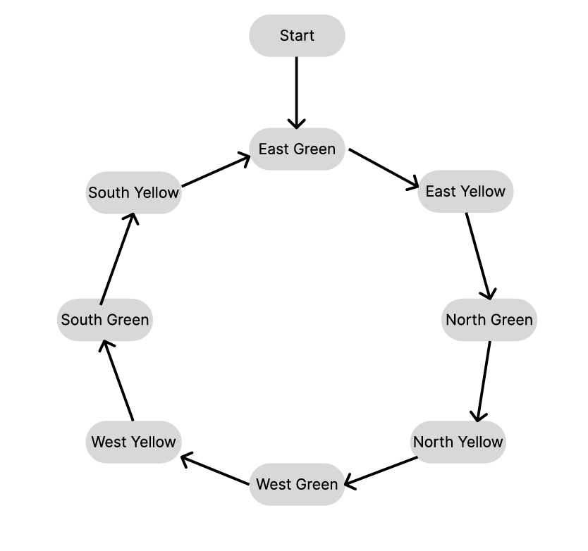

# Traffic Light System
This state diagram represents a 4-way traffic light system with 8 states, one for each directional green and yellow light cycle.

## States and duration

1. East Green - 40 seconds
2. East Yellow - 3 seconds
3. North Green - 40 seconds
4. North Yellow - 3 seconds
5. West Green - 40 seconds
6. West Yellow - 3 seconds
7. South Green - 40 seconds
8. South Yellow - 3 seconds

## Transition Flow
Each direction follows: Green → Yellow → Next Direction Green.
Sequence: East → North → West → South.

## Diagram

